# Dual XL-320 Assembly

You will need two assemblies of XL-320 in the torso: one in the upper part and one in the lower part. They provide the X-Y DOF for that part of the body. Unfortunatelly there are no standard parts from Robotis that allows the XL-320 to be mounted in a 90 degree position, so we will have to print some parts that will fulfill this scope.

The assembly instructions will apply to both the upper and lower torso, the only difference will be the IDs of the servos you will use.

To build a dual XL-320 assembly you will need:

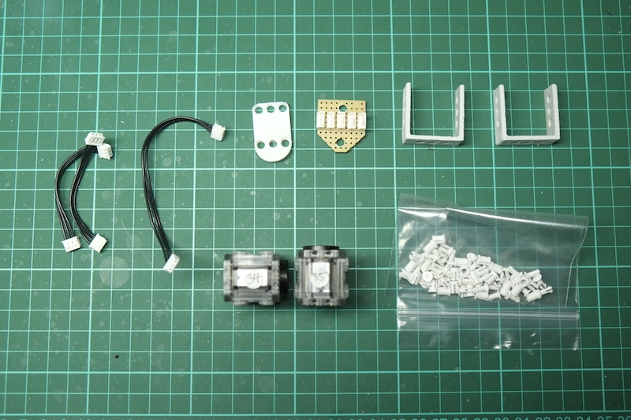

* 2 Dynamixel XL-320 preconfigured with the IDs (34, 35 for the upper torso and 31, 32 for the lower torso)
* 2 Dual XL mount 3D printed parts
* 1 Dual XL idle 3D printed part (in the picture there is an older version of the part, the one in the STL repository is slighly different, but not that much)
* 2 short XL cables: these are cables that were made from one standard 110mm XL-320 cable that was cut in two and connectors were added to the cut sides. Unlike the AX cables, Robotis does not sell cables shorter than 110mm for XL-320 and for some assemblies that is too long and can get in the way of other moving parts. We might try to see if it would be possible to produce some custom cables that can be commercialized in the future, but if you are really interested in robotics with Dynamixel servos it might be a good idea to invest in a relativelly unexpensive but reliable crimper and stripper. Alternativelly you can chose to use the standard 110mm cables instead of the shortered ones, but be careful obout how they are routed.
* 1 normal XL cable 110mm
* 1 custom made XL hub; this is the equivalent of the AX hub produced by Robotis that allows you to connect 3 cables together. Unfortunatelly there is no equvalent for XL servos, so we'll have to make it ourselved. The one you see is made on a simple strip board simply soldering 5 XL Molex connectors and adding 2 4mm holes that we will use to rivet the board in place.
* 18 2-step OLLO rivets
* 2 3-step OLLO rivets

Before we start building the assembly let's first understand what we will build and define some rules. The dual mount will position one of the servos on the Y axis and one on the X axis. Specifically the front servo will provide the Y DOF and the back servo the X DOF. The front servo will be positioned with the horn to the right (as seen from front) in order to mate properly with the next part in the assembly while the back servo will be positioned with the horn on the back. Both servos will have the horns on the the lower side (i.e. the bodies are upwards). The front servo will have the lower number and the back servo the higher number. This picture will give you some idea and it would be a good excersise to place the servos in this position before starting the assembly:

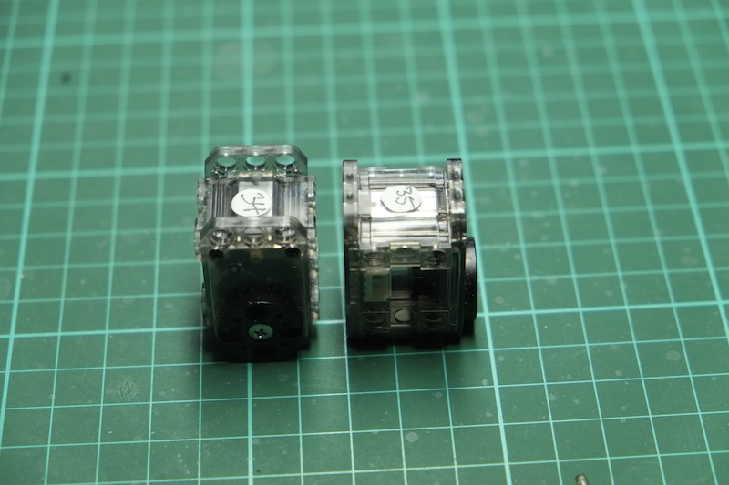

Now let's start the build! Take the front servo (34 for upper torso and 31 for lower torso) and connect one short cable on the connector that is at the back of the servo (inside, between the two servos). This will be the cable that will connect the two servos:

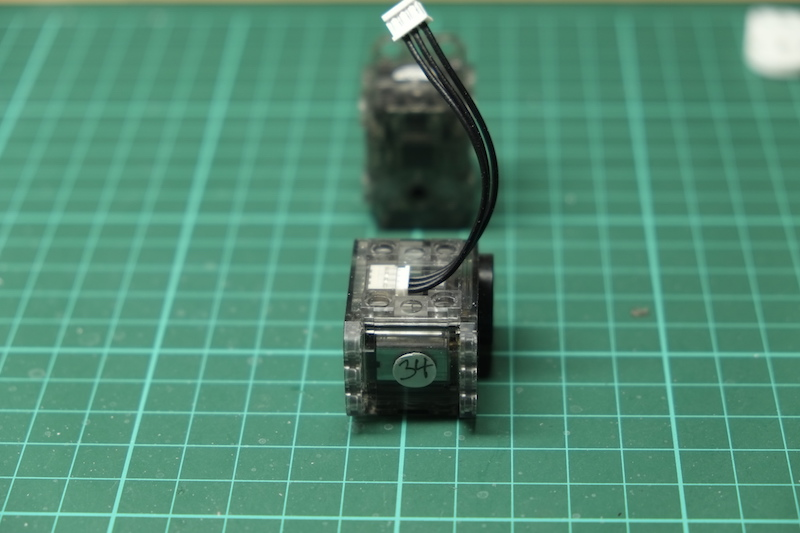

Now add the two dual mounts using three rivets each making sure that the cable is flowing nicely between them:

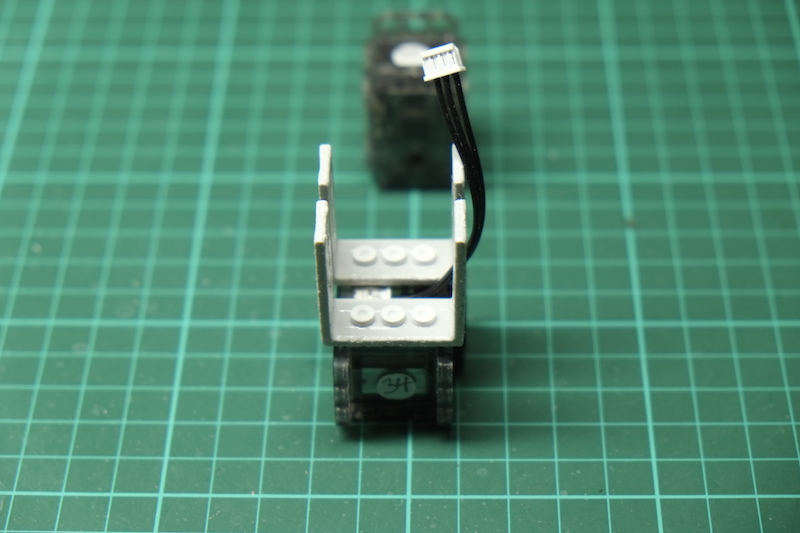

Connect the short cable to the second servo (35 for the upper torso and 32 for the lower torso) as seen in the picture bellow. Connect the longer cable to the other port of the second servo:

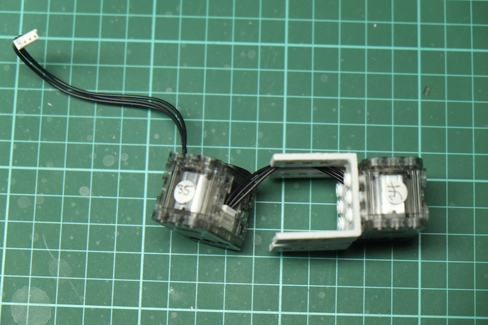

Now put the second servo in position between the XL dual mounts making sure that the cables are nicely flowing between them. Fix the servo on one side using four rivets:

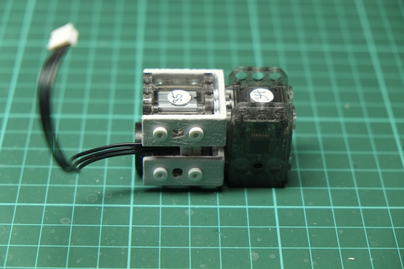

Add 4 more rivets on the other side:

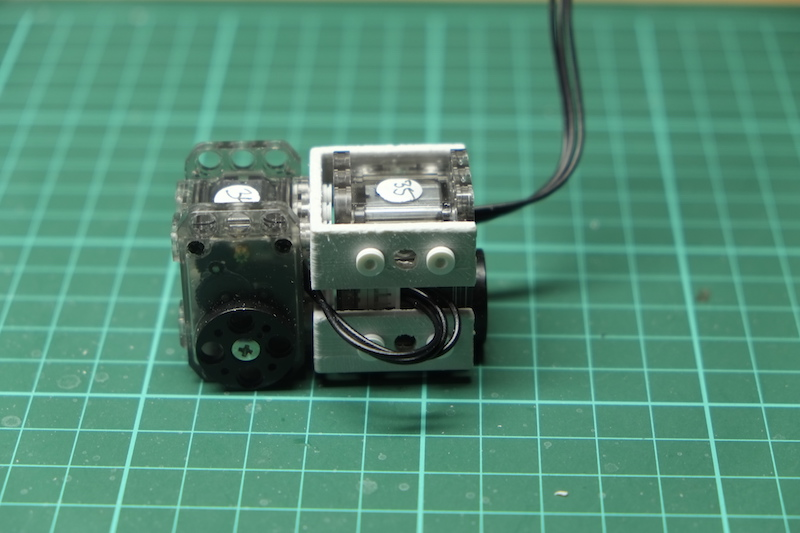

Add now the second short cable to the free connector at the front of the first servo and bend it 180 degrees so that it exits to the left as seen from front:

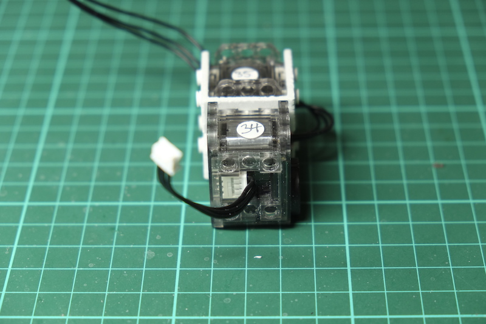

Place the XL idle on top of the front of the first servo, making sure that the cable is guided between the two mount holes of the servo. Fix the XL idle using four rivets as shown in the picture. The two rivets on the idle circle should be flush with the surface and if you place your finger over that sourface you should not feel them sticking out.

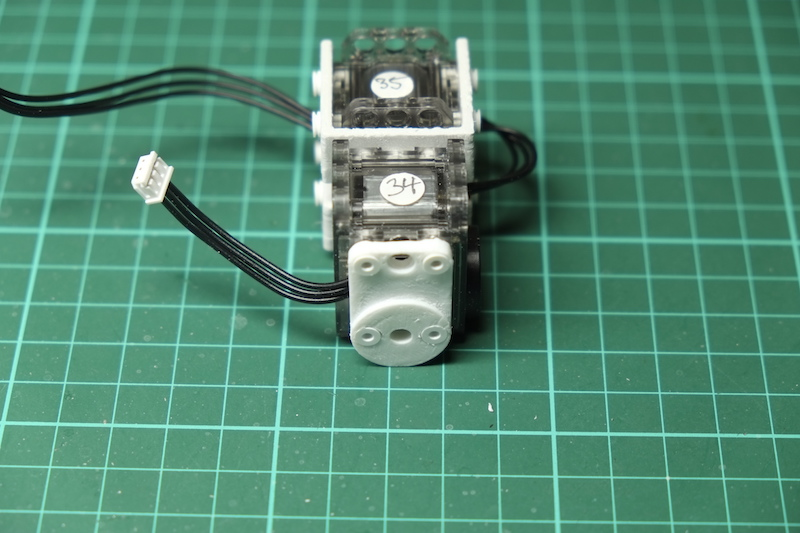

Guide the long XL cable towards the center of the assembly and then place the XL hub over the dual XL mount, aligning the holes. The 45 degrees cuts in the hub should face down. Fix the hub in place using two 3-step rivets:

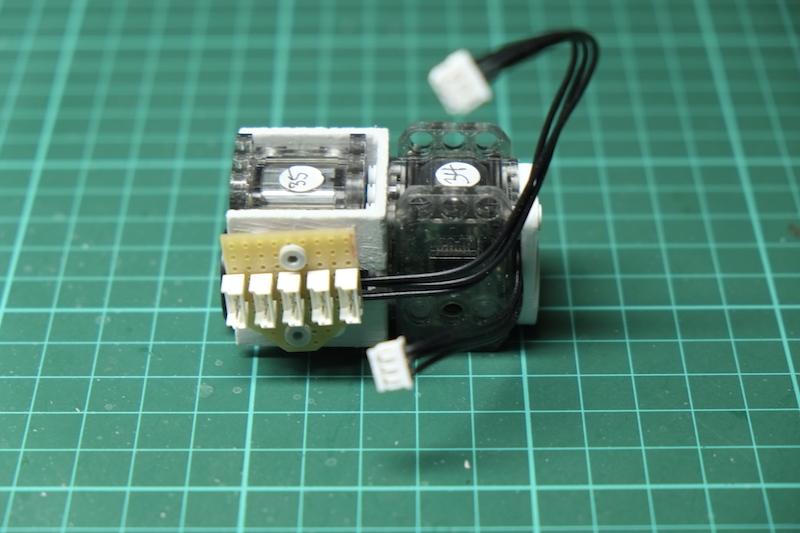

Connect the short cable coming from the front servo to the first connector in the hub:

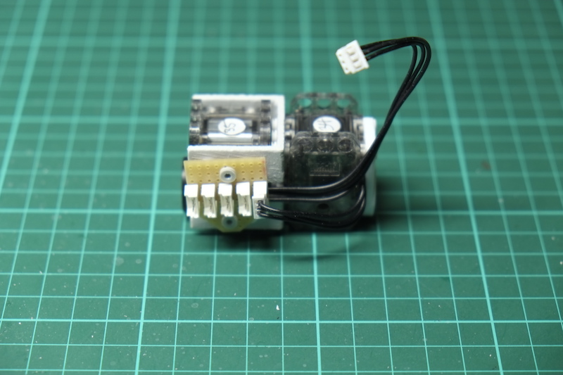

This concludes the build of the dual XL mount. Two of the connectors in the hub will be used by the limbs that are linked to the chain (arms for the upper torso and legs for the lower torso), one of the connector will be used to add some power redudancy between the two hubs and the remaining connector in each hub will be connected with a cable to the controller in the head.
