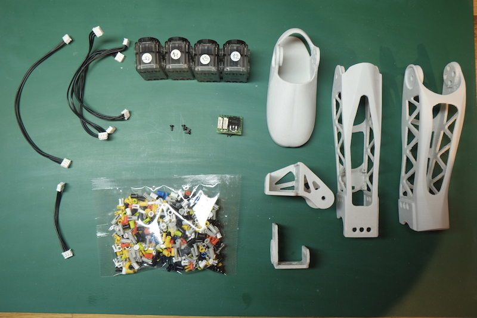
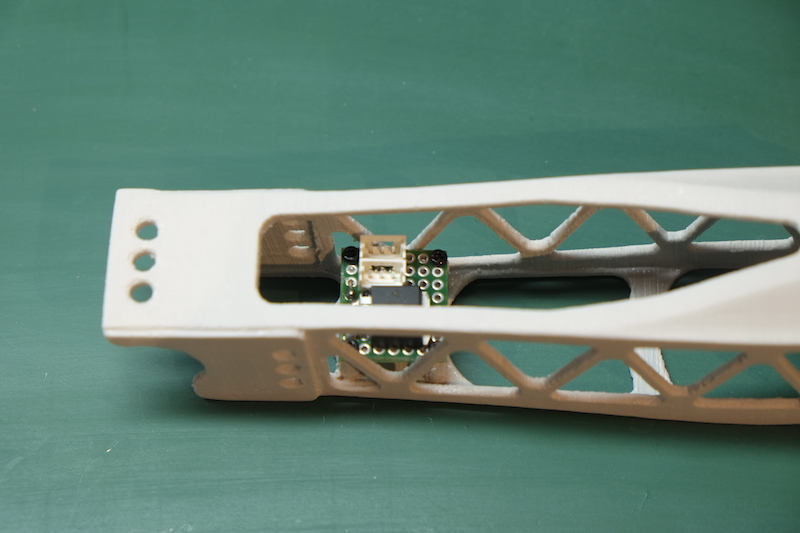
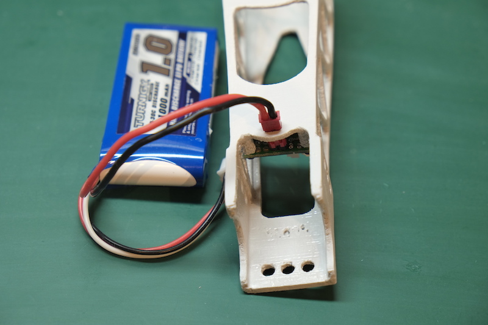
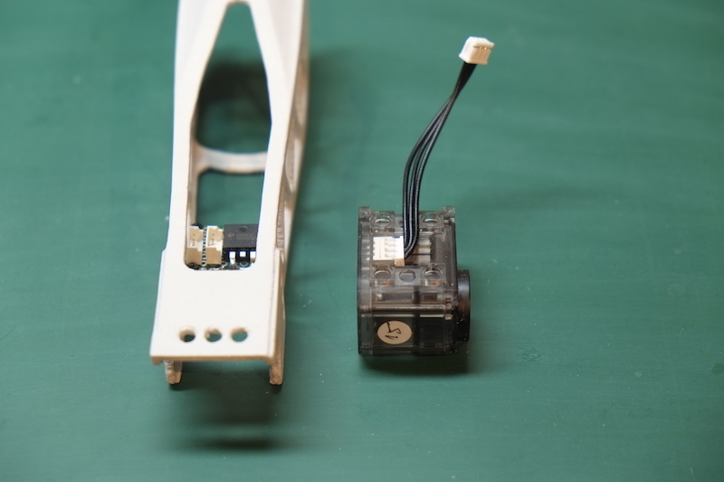
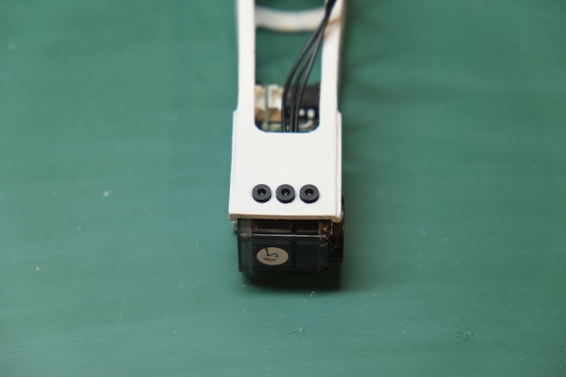
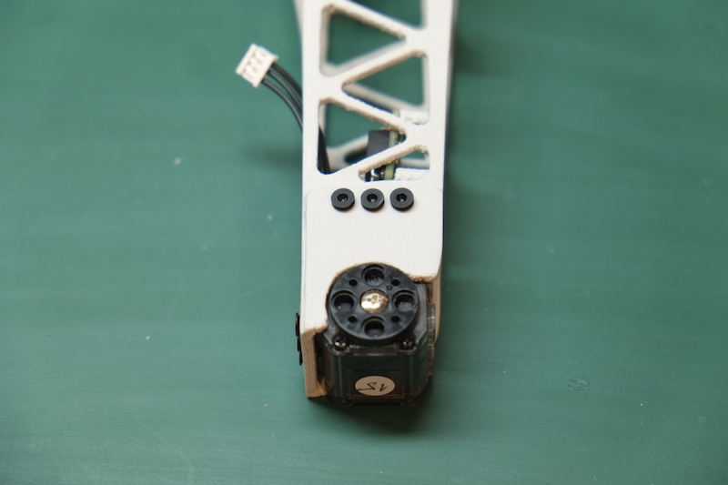
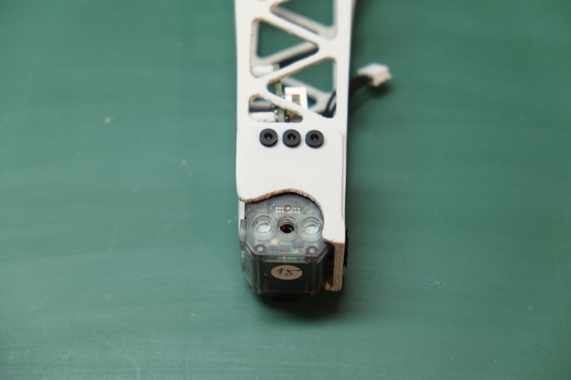
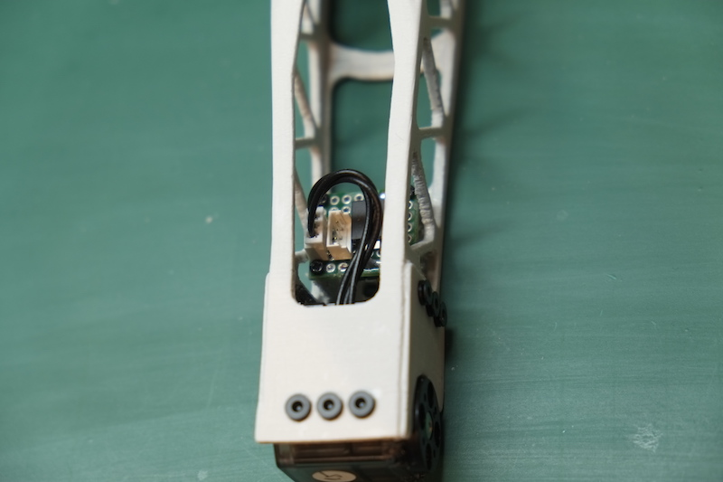
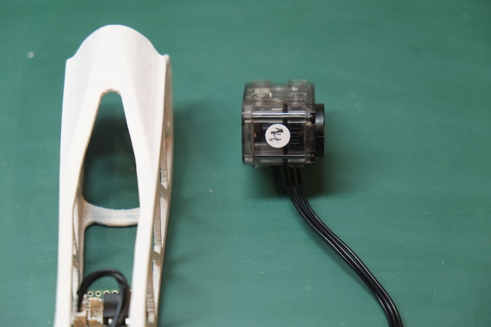

# Legs assembly

I will show you here only the assembly steps for the **left leg**. The right leg follows the same steps except that some parts are in mirror. I will give you the appropriate hints bellow when thee is someting you need to take care.

For the assembly of Poppy's left leg you will need:

1. The left foot
2. The left shin
3. The left thigh
4. One hip connector
5. The left hip
6. 4 Dynamixel XL-320 servos already configured with the IDs: 12, 13, 14 and 15 (for right leg they will be 22, 23, 24 and 25)
7. 3 Dynamixel cables - the standard ones that came with the servos
8. 1 160mm Dynamixel cable
9. 1 short Dynamixel cable - these are cables that were made from one standard XL-320 cable that was cut in two and connectors were added to the cut sides. Unlike the AX cables, Robotis does not sell cables shorter than 110mm for XL-320 and for some assemblies that is too long and can get in the way of other moving parts. We might try to see if it would be possible to produce some custom cables that can be commercialized in the future, but if you are really interested in robotics with Dynamixel servos it might be a good idea to invest in a relativelly unexpensive but reliable crimper and stripper. Alternativelly you can chose to use the standard 110mm cables instead of the shortered ones, but be careful obout how they are routed.
10. one hot-swap board; you can get the information about this board [here]
11. 40 2-step OLLO rivets
12. 2 3-step OLLO rivet

