# Arms assembly

I will show yyou here only the assembly steps for the **left arm**. The right arm follows the same steps except that some parts are in mirror. I will give you the appropriate hints bellow when thee is someting you need to take care.

For the assembly of Poppy's left arm you will need:
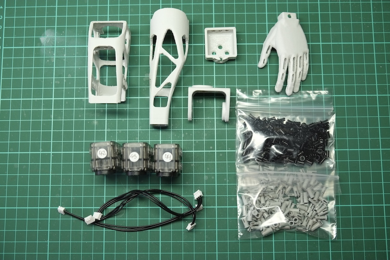

1. The left hand
2. The left forearm
3. Upper arm
4. Arm connector
5. The left shoulder (we actually will not connect this one here; later when we connect the arm to the torso we will mount the shoulder)
6. 3 Dynamixel XL-320 servos already configured with the IDs: 42, 43 and 44 (for right arm they will be 52, 53 and 54)
7. 3 Dynamixel cables - the standard 110mm that came with the servos
8. 28 2-step OLLO rivets
9. 1 3-step OLLO rivet

We will start by connecting the left hand with the left forearm. Please meke sure the open face of the forearm points in the same direction as the thumb. The horn holes (the side with 4 holes) are on the exterior of the arm, while the idle (the side with one hole and bump) is on the interior of the arm.

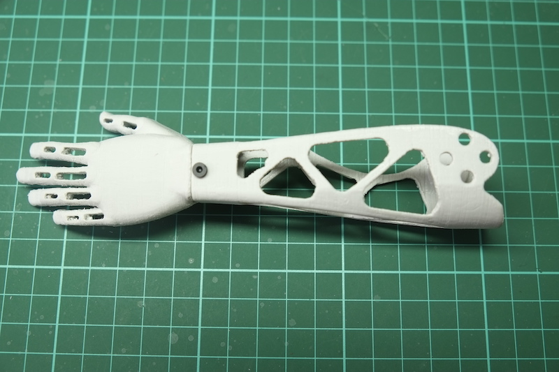

Add one rivet on one side and another one on the other side (to save time anytime I say rivet I refer to the 2-step ones, when you will need to use a 3-step one I will say it explicitly; in my assembly the 2-step ones are black and the 3-step ones are grey).

Now take the servo numbered 43 (for right hand 53) and attach cables to both connectors. Then guide the cables as in the picture bellow, one towards the front and one towards the back, making sure that the cables sit between the mounting supports of the servo.

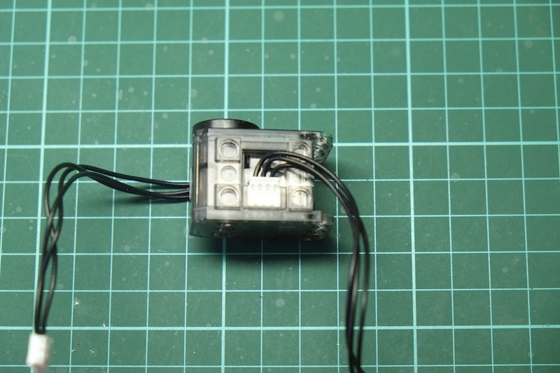

Slide the servo in the upper part of the upper arm so that the horn faces the round cut on the top and directing the cable that enters first into the upper arm downwards as seen in the picture.

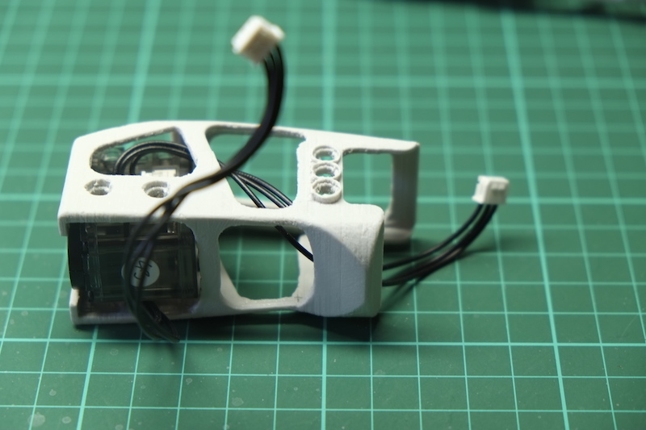

Add two rivets on the side of the upper arm to fix the servo.

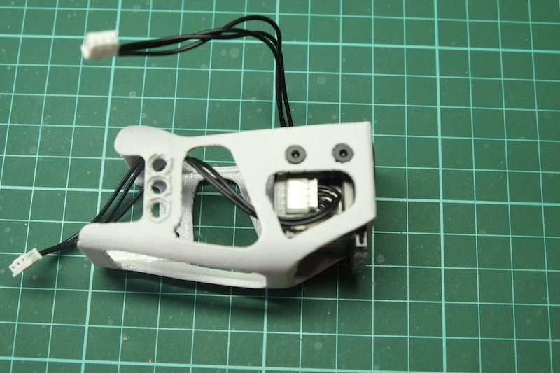

Add two more rivets on the opposite side of the upper arm. Then add three more rivets on the underside part fixing securely the servo in place.

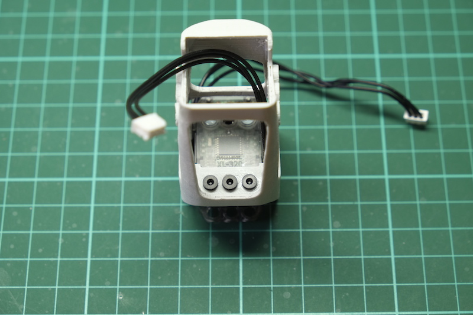

Connect the servo 44 (54 for the right arm) to the cable that comes down the upper arm. It is not really important on what side of the servo you are connecting it.

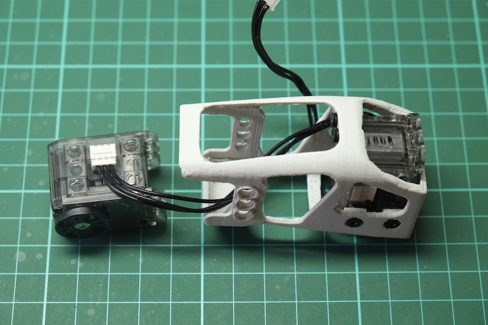

To understand the position of this servo (elbow) you need to remember that the horns always face the exterior, so in the case of the left arm, as we're looking from the front of the arm the horn will face towards right (for the right arm the horns of the servo 54 will face left). Place the servo in the upper arm and secure it with three rivets.

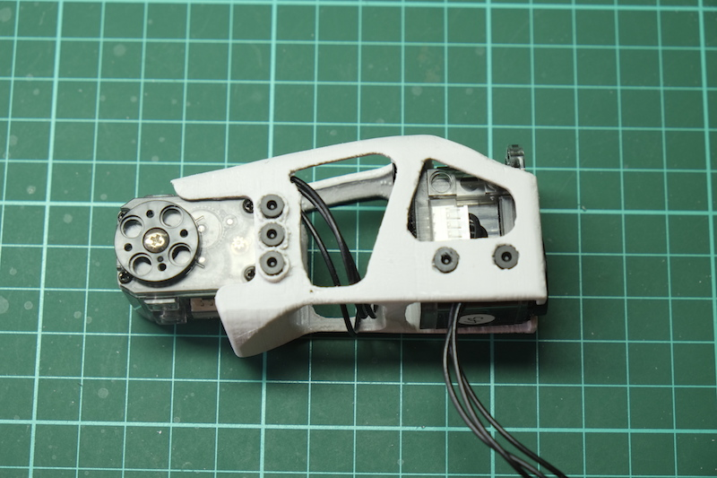

Add three more rivets on the other side.

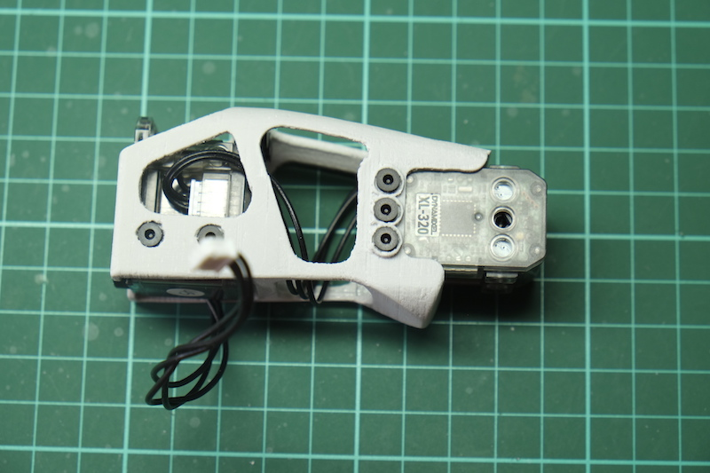

Now fis the arm connector on the horn af the upper servo using four rivets. Make sure that the servo is in the 0 position before doing this.

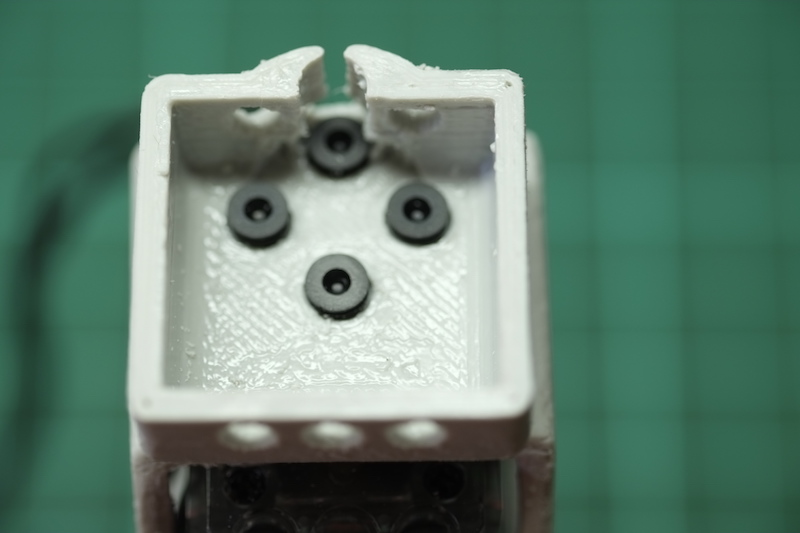

Guide the cable coming from the upper servo through the channel of the arm connector.

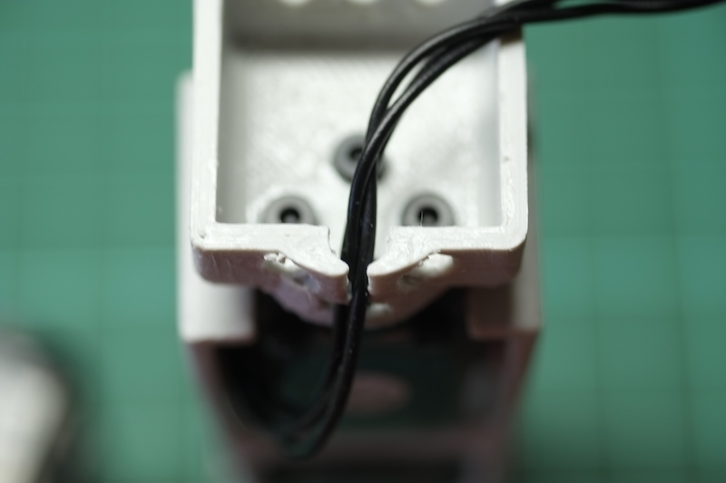

Connect the cable to the servo 42 (52 for the right arm). The side you need to connect is the one that will be facing outside of the arm (for the left arm this is towards right) when the servo is placed in position on the arm connector. Place the servo on the arm connector so that the horn face the front of the arm and the back of the servo faces the channel in the arm connector.

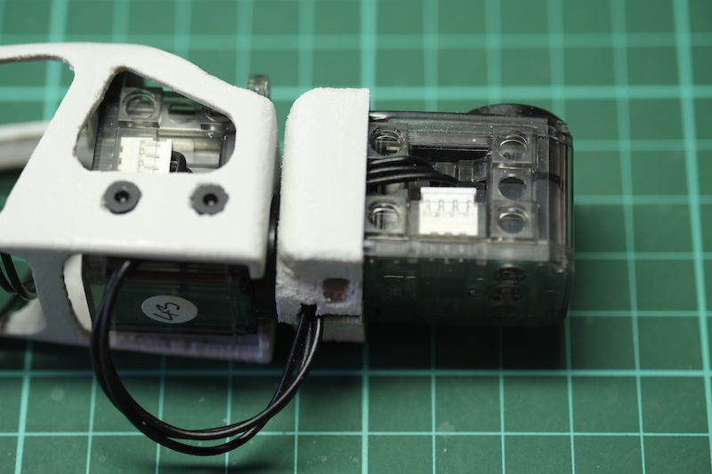

Use three rivets to fix the servo in the front:

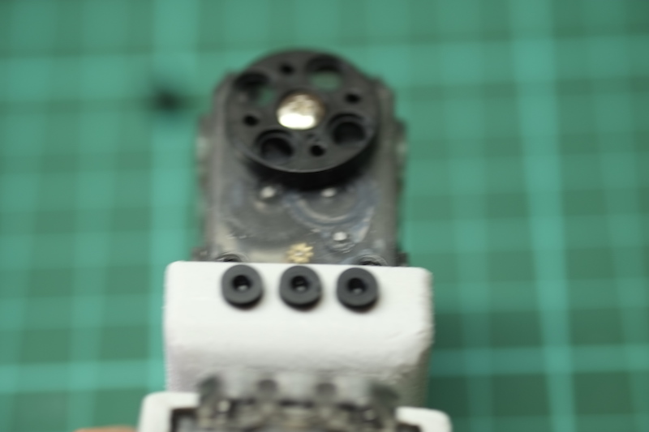

And two more rivets to fix the servo in the back:

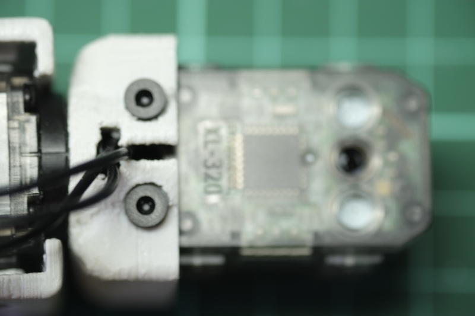

Connect now the previously mounted forearm to the lower servo of the upper arm using four rivets. Make sure that the servo 44 (or 54 for right arm) is set to 0 position. There should be a small gap between the forearm and the upper arm at the back of the elbow:

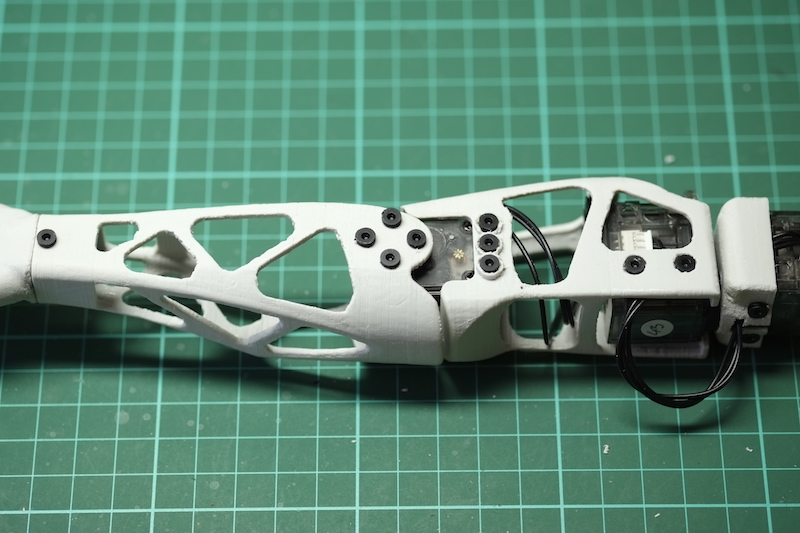

Add one more 3-step rivet on the other side:

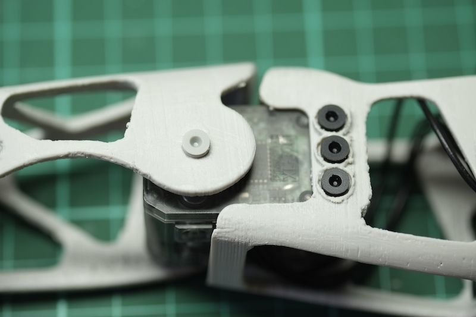

Congratulations, you have now completed the assembly of the left (or right) arm! 

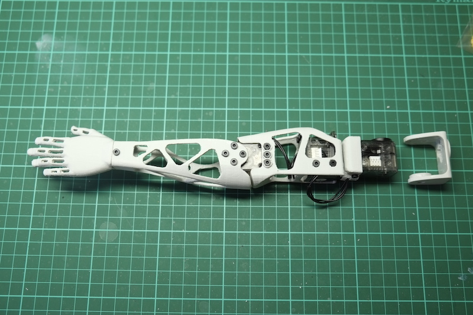

The shoulder part will not be mounted at this time as it will be difficult to mount it later on the shoulder_y servo that will be placed in the chest. We will provide instructions for this in the final assembly.
