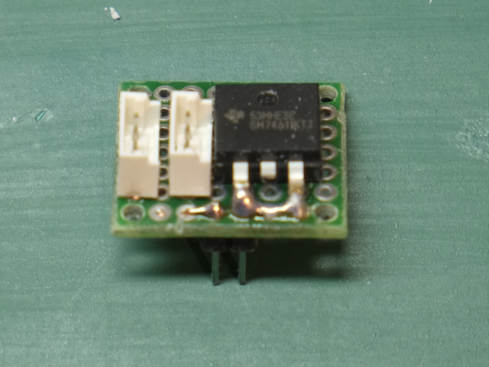
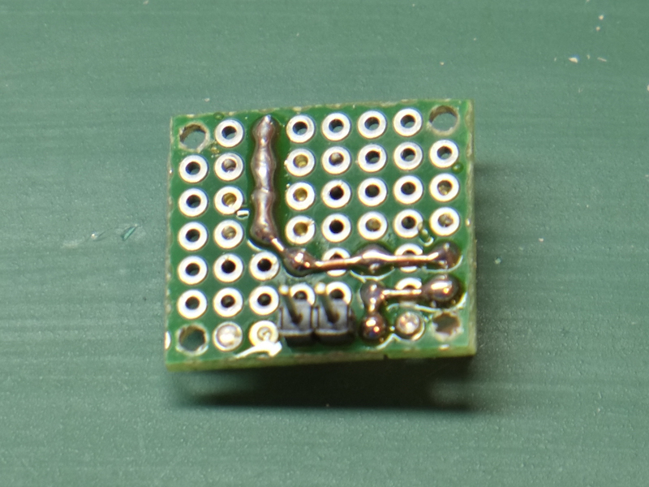

# Hot-Swap board

For Poppy Seed we will use LiPo batteries to power the Dynamixel bus as well as the electronics. We will use two LiPo batteries (2S - 1000mA) each one located in the foot. Using two batteries provides a number of advantages:

* equal distribution of weight
* more capacity (2 x 1000mA)
* ability to swap the batteries one by one thus reducing the need to power down the electornics (mainly the Raspberry Pi)
* because the batteries a positioned in the lowest possible place it reduces the position of the center of mass for the robot, improving stability

In order to be able to use 2 LiPo batteries in parallel and expecially to allow hot-swapping of the batteries (ex. removing one of the batteries that is discharged and replacing it with a fresh battery) we need to control the way the current flows between these batteries. If we connect the batteries blindly in parallel, when batteries are discharged (ex. aprox. 7V or bellow) and one of the batteries is replaced with a new battery (ex. aprox. 8.4V) the difference in potential between the two batteries will produce a so called "rush current" - practically it is as if the new battery is shorted. This is extrmely dangerous as the currents can reach (for short period of time, true) 2-3 times more than the dicharge current that the battery can support.

To avoid this scenario we need to place in series with the battery a diode that allows the current to flow in only one direction (from the battery to the consumer) thus blocking the flow towards the battery (which happens for instance in the case of the discharged battery). A simple diode might foot the bill here provided that it is dimensioned corectly for the power disipassion needed. A typical silicon diode has a forward voltage of 0.7V - meaning we will loose 0.7 V from the battery voltage. In our case this is not very good news because we will loose aprox 10% of the 2S LiPo voltage which is not acceptable. Additionally with an expected current of 2A going through this diode we would have a power dissipation of 0.7V x 2A = 1.4W which will be quite a hefty diode. And a hot one indeed.

The alternative is to use a diode with a forward voltage as lower as possible. This is what the Schottky diodes are for: their forward voltage is in the range 0.35V, some even lower. That means lower power consumption (and heat) as well as less loss of potential from the battery.

The most elegant solution though is to use the Texas Instruments' [SM74611KTTR](http://uk.farnell.com/texas-instruments/sm74611kttr/hot-swap-controller-30v-to-263/dp/2492333) hot swap controller that is designed for the current flow in photovoltaic pannels. This is an actually complex device that includes a high power MOSFET (that ensures a low forward voltage) and a sophisticated charge pump and controller that ensures a very low power consumption and very high efficiency. The forward voltage these "smart bypass diodes" is typically 28mV!

The board for the Poppy Seed hot-swap is build with such a smart diode and it includes in addtion:

* 2 [MOLEX connectors 52253 Micro-Latch](http://uk.farnell.com/molex/53253-0370/header-2-0mm-3way/dp/1756921)
* One 2 pin standard 2.54 pin header
* a small prototyping board

The two Molex connectors and the smart diode is placed on one face of the board:

While the 2-pin head is on the other side:

The connections are pretty intuitive:

* the pin-head as seen from the side with the parts (the first picture above) is connected with the right pin to the + of the battery and the left pin to the - of the battery. This is controlled by the hole at the back of the shin that allows you to connect the battery in only one way
* the + from the pin is connected to the anode of the diode (the pins)
* the cathode of the diode (the DAP area) then connects to the VCC pins of the Dynamixel bus (center of the two MOLEX connectors)
* the - from the battery connects to the GND pins of the Dynamixel bus (the lower pins in the first picture)
* the 2 MOLEX pins are connected pin-to-pin as you can see in the second picture

The board has 4 holes in the corners with 17.78mm horizontal distance between them (7 standard 0.1' holes) and 15.24mm vertical distance (6 holes). This is the distance between the supports in the shin.

When the battery is connected in the 2 pins on the back side it will inject the voltage into the Dynamixel bus that is connected to the MOLEX connectors. If there is already voltage in the bus (for example there is already another battery on the chain) and that voltage is higher than the voltage of our battery then the diode will break the circuit and our battery will no longer be connected to the bus (this is the case of a discharged battery). If the voltage of our battery is higher than the existing voltage of the chain (if any) than the diode will let the current flow through the circuit, powering the bus.
