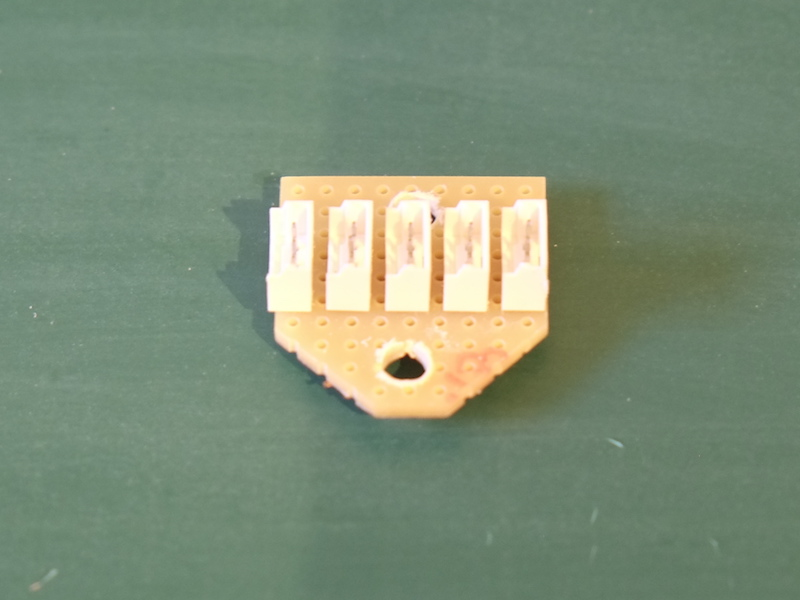
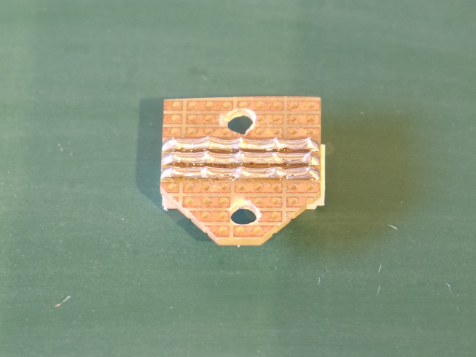

# Dynamixel XL hub

Unlike the AX bus, there is no original [Robotis hub](http://www.robotis-shop-en.com/?act=shop_en.goods_view&GS=1398&GC=GD080300) that allows you to connect together several Dynanixel cables for XL bus. It is quite easy to put this together with a little bit of soldering skills.

You will need:
* a small prototyping board - preferrably one with stripes
* 5 [MOLEX microblade board connectors](http://uk.farnell.com/molex/53253-0370/header-2-0mm-3way/dp/1756921)

As tools you will need:
* a soldering iron
* solder
* small pliars
* a drill with a 4mm bit
* a hand saw (to trim the board)

The board as seen on the component face looks like this:

Cut the board so that you have 9 x 10 holes availalable. We will solder the 5 MOLEX connectors alon those 9 holes while the vertical 10 holes will allow us to drill 2 4mm holes at aproximately 18mm distance.

Solder the 5 MOLEX connectors on the boards and connect them pin to pin. The following picture should give you an idea of the back of the board:

The board has normally 2.54 pitch and the MOLEX connectors have 2mm. Don't be put off by this: gently push the exterior connector a little so that they can be placed in the holes, then presss firmly the connector onto the board. You will see that you can press it all the way until the bottom of the connector is in contact with the board. Solder the connector on the back. Then, looking at the pins of the connector you will see that they have been bent towards the center of the connector. Take a small pliers and simply straighten them back to the vertical position. Repeat this for all the 5 connectors.

Now make two 4mm holes at 7 holes distance = 17.78mm. This is good enough to allow us to mount this board on the side of a servo using the mounting holes that have 18mm. When making this holes the best is to use 2mm, 3mmm and then 4mm drills instead of going straight to the 4mm drill. You will have less changes for your drill to slip one side or the other.

When you're done cut the corners of the board as you see in the pictures. This will reduce the risk of faulting moving parts from the robot while the board is in position close to joints.

You will have to prepare two of these boards for a Poppy Seed, one for the upper torso and one for the lower torso.
